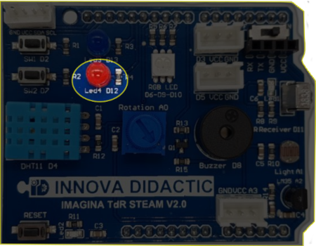
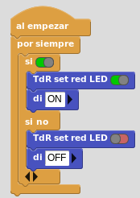
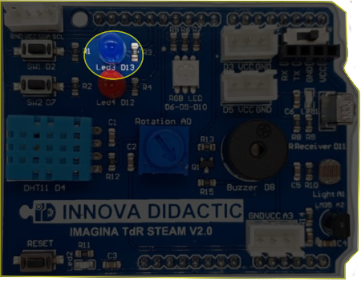
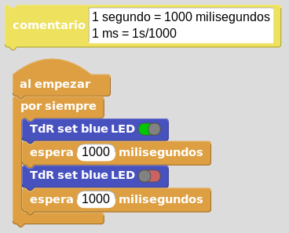
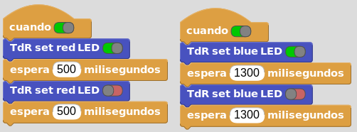
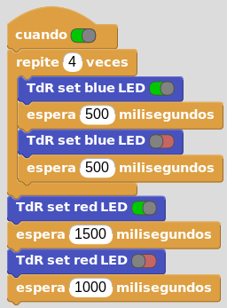

# A1- Diodos LED
Actividades resueltas y propuestas con los dos diodos LED que incorpora la placa TdR STEAM.

## **LED rojo**
La placa Imagina TDR STEAM dispone de un LED rojo conectado al pin D12 tal y como se indica en la serigrafía de la propia placa y que podemos ver en la imagen siguiente:

  
*LED rojo en la TdR STEAM*

En el video siguiente vemos el funcionamiento "en vivo" del programa en la placa y en el ordenador, una de las grandes ventajas de MicroBlocks, mediante un sencillo programa que nos permite encender y apagar el LED de forma manual.

<iframe width="560" height="315" src="https://www.youtube.com/embed/4F7jcsun9_g?si=4Q_wTVPXw_ScrTn2" title="YouTube video player" frameborder="0" allow="accelerometer; autoplay; clipboard-write; encrypted-media; gyroscope; picture-in-picture; web-share" allowfullscreen></iframe>

Podemos descargar el programa [LED_rojo.ubp](../actividades/programas/LED_rojo.ubp) o bien crearlo nosotros mismos a partir de la figura siguiente:

  
*LED_rojo.ubp*

## **LED azul**
La placa Imagina TDR STEAM dispone de un LED azul conectado al pin D13 tal y como se indica en la serigrafía de la propia placa y que podemos ver en la imagen siguiente:

  
*LED azul en la TdR STEAM*

Debemos tener presente que el LED conectado al pin 13 va a parpadear siempre que reiniciemos la placa, lo cual ocurre cada vez que carguemos firmware en la misma. Una vez finalizada la carga el LED se comportará según indiquemos en nuestro programa.

En el video siguiente vemos el funcionamiento de un sencillo programa que hace que el LED parpadee a intervalos de un segundo.

<iframe width="560" height="315" src="https://www.youtube.com/embed/6UJYR4jhqkg?si=-3TPGEzP3bMnk4Lr" title="YouTube video player" frameborder="0" allow="accelerometer; autoplay; clipboard-write; encrypted-media; gyroscope; picture-in-picture; web-share" allowfullscreen></iframe>

Podemos descargar el programa [LED_azul.ubp](../actividades/programas/LED_azul.ubp) o bien crearlo nosotros mismos a partir de la figura siguiente:

  
*LED_azul.ubp*

## **Multitarea**
Vamos a comprobar como MicroBlocks es por naturaleza capaz de trabajar en multitarea. Para ello vamos a hacer parpadear a ambos diodos LED a diferentes intervalos de tiempo y como se produce el efecto sin ningún tipo de problema. Además en este caso la placa base es una ESP32 que ya dispone de doble núcleo de procesador, por lo que la multitarea de dos tareas nos es ningún problema.

En el video siguiente vemos el funcionamiento de un programa que hace que el LED rojo parpadee a intervalos de 500 ms y el diodo LED azul a intervalos de 1.3 ms.

<iframe width="560" height="315" src="https://www.youtube.com/embed/PErrHpp2Ya8?si=zIkAs221iMH5C_WW" title="YouTube video player" frameborder="0" allow="accelerometer; autoplay; clipboard-write; encrypted-media; gyroscope; picture-in-picture; web-share" allowfullscreen></iframe>

Podemos descargar el programa [Multitarea_D12_D13.ubp](../actividades/programas/Multitarea_D12_D13.ubp) o bien crearlo nosotros mismos a partir de la figura siguiente:

  
*Multitarea_D12_D13.ubp*

## **Ampliación**
Se proponen, como retos de ampliación, las siguientes actividades:

**R1_A1**. Cambiar los tiempos para que el parpadeo sea más rápido, mas lento y que los tiempos de encendido y apagado no coincidan utilizando uno solo de los diodos LED.

**R2_A1**. Crear un programa que haga que los LEDs rojo y azul se enciendan simultáneamente con tiempos de espera de 300ms y 150ms respectivamente.

**R3_A1**. Crear un programa que realice 4 intermitencias de 500ms con el LED azul y cuando estas acaben que encienda el LED rojo durante 1.5 segundos. Crear una espera un segundo antes de iniciar de nuevo el proceso.

<b>Solución R3_A1</b>

  
*Solución R3_A1*

**R4_A1**. Crear un programa que realice 5 intermitencias de 500ms con el LED azul cada vez que el LED rojo lo hace 3 veces a intervalos de 150ms. Esperar un segundo para iniciar de nuevo el proceso.

**R5_A1**. Cambiar los tiempos en el ejemplo de multitarea de forma que coincidan y también que sean uno múltiplo del otro, analizando los resultados.