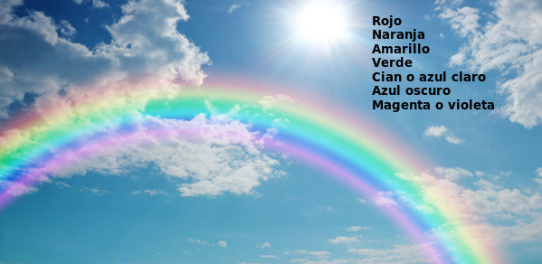

# A2- Diodo LED RGB

## **Actividad**
La placa Imagina TDR STEAM dispone de un LED RGB conectado a los pines D6, D9 y D10 tal y como se indica en la serigrafía de la propia placa y que podemos ver en la imagen siguiente:

  
*LED RGB en la TdR STEAM*

El programa de la actividad va a consistir en encender de manera secuencial cada uno de los diodos R, G y B de manera individual. En el video siguiente vemos el funcionamiento del programa después de poner en funcionamiento el bloque "TdR set RGB LED.

<iframe width="560" height="315" src="https://www.youtube.com/embed/U8h47PaWYhQ?si=KCOp8FsNEjjdzAVG" title="YouTube video player" frameborder="0" allow="accelerometer; autoplay; clipboard-write; encrypted-media; gyroscope; picture-in-picture; web-share" allowfullscreen></iframe>

Podemos descargar el programa [LED_RGB.ubp](../actividades/programas/LED_RGB.ubp) o bien crearlo nosotros mismos a partir de la figura siguiente:

  
*LED_RGB.ubp*

## **Ampliación**
Se proponen, como retos de ampliación, las siguientes actividades:

**R1_A2**. A partir de la idea del reto realizar un programa que muestre sucesivamente los siguientes colores: magenta o violeta, cian o azul claro, amarillo y blanco. Nos podemos ayudar del gráfico que muestra el modelo aditivo de colores que encontramos en la [Wikipedia](https://es.wikipedia.org/wiki/RGB).

**R2_A2**. Crear un programa que muestre un color aleatorio cada dos segundos.

<b>Solución R2_A2</b>

  
*Solución R2_A2*

**R3_A2**. Crear un programa que muestre de manera secuencial los colores del arcoiris en el orden que vemos en la imagen.

  
*Colores del arcoiris*

