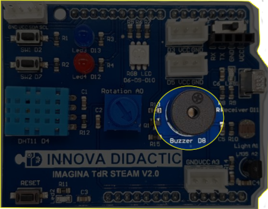
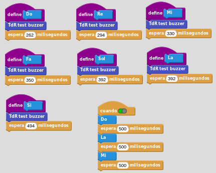
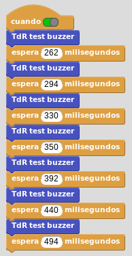

# A3- Zumbador

## **Actividad**
La placa Imagina TDR STEAM dispone de un zumbador pasivo o altavoz (Buzzer) conectado al pin D8 tal y como se indica en la serigrafía de la propia placa y que podemos ver en la imagen siguiente:

  
*El zumbador pasivo o altavoz (Buzzer)*

El programa de la actividad va a consistir en crear los bloques de las notas musicales básicas y reproducir algunas de ellas. En el video siguiente vemos y escuchamos el funcionamiento del programa.

<iframe width="560" height="315" src="https://www.youtube.com/embed/lXeRHgpdE3A?si=OksOiOzIePMa0rfx" title="YouTube video player" frameborder="0" allow="accelerometer; autoplay; clipboard-write; encrypted-media; gyroscope; picture-in-picture; web-share" allowfullscreen></iframe>

Podemos descargar el programa [Buzzer.ubp](../actividades/programas/Buzzer.ubp) o bien crearlo nosotros mismos a partir de la figura siguiente:

  
*Buzzer.ubp*

## **Ampliación**
Se proponen, como retos de ampliación, las siguientes actividades:

**R1_A3**. A partir del bloque crear un programa que reproduzca las escala musical básica.

<b>Solución R1_A3</b>

  
*Solución R1_A3*

**R2_A3**. Completar la escala musical del reto anterior con las notas que faltan.

**R3_A3**. Crear un programa que reproduzca la melodía de la imagen siguiente sabiendo que las negras tienen una duración de 500ms, las negras con un puntito 750ms y las blancas 1000ms.

  
*Himno a la alegria*

