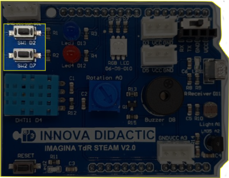
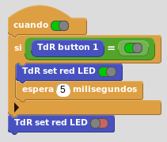
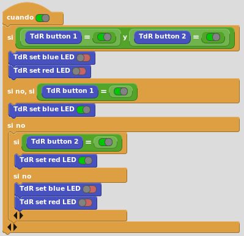
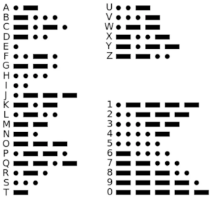
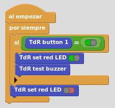
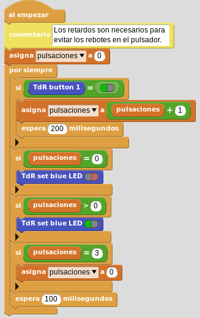

# A4- Pulsadores

## **Actividad**
La placa TdR STEAM dispone de dos pulsadores denominados SW1 y SW2 y conectados a los pines digitales D2 y D7 respectivamente, tal y como se indica en la serigrafía de la propia placa y que podemos ver en la imagen siguiente:

  
*Pulsadores en la TdR STEAM*

El programa de la actividad va a consistir en hacer un programa en el que preguntemos si el pulsador SW1 (D2) está o no pulsado y si lo está que se encienda el LED rojo (D12) y si no lo pulsamos que permanezca apagado. En el video siguiente vemos el funcionamiento del programa.

<iframe width="560" height="315" src="https://www.youtube.com/embed/RHvDnPaX2ME?si=hxurCNN-DxK8LvHb" title="YouTube video player" frameborder="0" allow="accelerometer; autoplay; clipboard-write; encrypted-media; gyroscope; picture-in-picture; web-share" allowfullscreen></iframe>

Podemos descargar el programa [pulsador.ubp](../actividades/programas/pulsador.ubp) o bien crearlo nosotros mismos a partir de la figura siguiente:

  
*Pulsador.ubp*

## **Complementaria**
En esta ocasión vamos a crear una actividad complementaria que utiliza ambos pulsadores.

El programa de la actividad va a consistir en hacer que se encienda el LED azul al pulsar SW1 y el LED rojo al pulsar SW2 se encienda el rojo permaneciendo apagados si no están pulsados. Observese la primera condición AND (Y) que impide que si pulsamos ambos pulsadores al mismo tiempo se enciendan los LEDs. En el video siguiente vemos el funcionamiento del programa.

<iframe width="560" height="315" src="https://www.youtube.com/embed/Tl8qgIxGEVE?si=ZmM5-rJFK6Sb5uRI" title="YouTube video player" frameborder="0" allow="accelerometer; autoplay; clipboard-write; encrypted-media; gyroscope; picture-in-picture; web-share" allowfullscreen></iframe>

Podemos descargar el programa [pulsadores.ubp](../actividades/programas/pulsadores.ubp) o bien crearlo nosotros mismos a partir de la figura siguiente:

  
*Pulsadores.ubp*

## **Ampliación**
Se proponen, como retos de ampliación, las siguientes actividades:

**R1_A4**. Resolver la actividad inicial de forma que el funcionamiento sea al contrario, es decir, que el LED rojo esté siempre encendido y al pulsar SW1 se apague.

**R2_A4**. Hacer un programa que al pulsar SW1 se encienda el LED azul y que al pulsar SW2 se apague. Como ampliación se sugiere modificar el programa para que encienda y apague los dos LEDs a un tiempo.

**R3_A4**. Hacer un programa que emita, usando SW1 como si fuese un telégrafo, el código Morse universal de solicitud de socorro, SOS. El alfabeto Morse lo vemos en la imagen siguiente:

  
*Alfabeto Morse*

<b>Solución R3_A4</b>

Podemos observar que la S son tres puntos o pulsaciones cortas y la O son tres rayas o pulsaciones largas. Sin entrar en mas detalles daremos la solución considerando SOS como una palabra (es lo universalmente adoptado) de forma que no haremos pausas entre letras.

  
*Solución R3_A4*

**R4_A4**. Hacer un programa que al pulsar SW1 encienda el LED azul y que este permanezca encendido hasta que no pulsemos SW1 dos veces mas (3 pulsaciones en total), en cuyo caso se apagará.

  
*Solución R4_A4*

