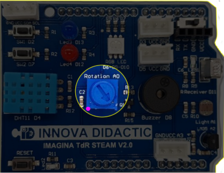
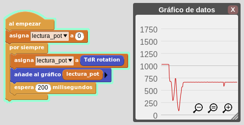
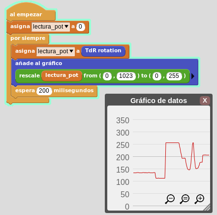

# A5- El potenciómetro

## **Actividad**
La placa Imagina TDR STEAM dispone de un potenciómetro, denominado Rotation, conectado al pin A0 tal y como se indica en la serigrafía de la propia placa y que podemos ver en la imagen siguiente:

  
*El potenciometro de la TdR STEAM*

### Parte 1
El programa de esta parte de la actividad va a consistir en graficar los datos suministrados por el potenciómetro. En el video siguiente vemos el funcionamiento del programa.

<iframe width="560" height="315" src="https://www.youtube.com/embed/Ze-Me8f3HCw?si=vgL-NpctfSfVvWUK" title="YouTube video player" frameborder="0" allow="accelerometer; autoplay; clipboard-write; encrypted-media; gyroscope; picture-in-picture; web-share" allowfullscreen></iframe>

Podemos descargar el programa [potenciometro_parte1.ubp](../actividades/programas/potenciometro_parte1.ubp) o bien crearlo nosotros mismos a partir de la figura siguiente:

  
*potenciometro_parte1.ubp*

¡MUY IMPORTANTE! Si la placa no se conecta<b></b>

>
  * **Cuando terminemos de manipular el potenciómetro para el objetivo del programa actual, debemos asegurarnos de que el mismo esté totalmente girado a la posición izquierda. Si no está en esa posición se producirá un error en el siguiente intento de envío del programa.**

### Parte 2
El programa de esta parte de la actividad va a consistir en graficar los datos suministrados por el potenciómetro pero mapeando los valores. En el video siguiente vemos el funcionamiento del programa.

<iframe width="560" height="315" src="https://www.youtube.com/embed/uTB2eGqxMYI?si=EU0RiOAT0FGafTty" title="YouTube video player" frameborder="0" allow="accelerometer; autoplay; clipboard-write; encrypted-media; gyroscope; picture-in-picture; web-share" allowfullscreen></iframe>

Podemos descargar el programa [potenciometro_parte2.ubp](../actividades/programas/potenciometro_parte2.ubp) o bien crearlo nosotros mismos a partir de la figura siguiente:

  
*potenciometro_parte2.ubp*

## **Ampliación**
Se proponen, como retos de ampliación, las siguientes actividades:

**R1_A5**. A partir del programa de la actividad (parte 1 o parte 2) crear un programa que nos muestre el mensaje "Potenciometro: " y a continuación nos muestre el valor leido. Dejaremos transcurrir un tiempo de 3s entre cada actualización del dato de salida.

**R2_A5**. Control del LED RGB con el potenciometro. Vamos a dividir el rango total en 8 partes y asignarle a cada una de ellas uno de los colores RGB según vemos en la tabla siguiente:

| Color | Rango | R | G | B |
|---|:|:|:|:|
| Rojo | 0 a 127 | 255 | 0 | 0 |
| Verde | 128 a 255 | 0 | 255 | 0 |
| Azul | 256 a 384 | 0 | 0 | 255 |
| Amarillo | 385 a 512 | 255 | 255 | 0 |
| Cian | 513 a 640 | 0 | 255 | 255 |
| Magenta | 641 a 768 | 255 | 0 | 255 |
| Blanco | 769 a 896 | 255 | 255 | 255 |
| Naranja | 897 a 1023 | 255 | 127 | 0 |

**R3_A5**. Repetir R2_A5 pero ahora además mostrando por de forma gráfica el valor del potenciometro.
