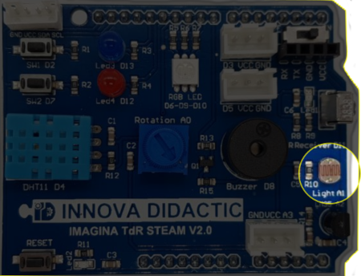
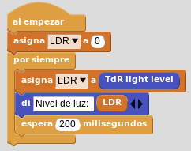

# A6- La fotorresistencia o LDR

## **Actividad**
La placa Imagina TDR STEAM dispone de una resistencia LDR, denominada Light, conectada al pin A1 tal y como se indica en la serigrafía de la propia placa y que podemos ver en la imagen siguiente:

  
*La LDR en la TdR STEAM*

El programa de la actividad va a consistir en mostrar los datos suministrados por la LDR. En el video siguiente vemos el funcionamiento del programa.

<iframe width="560" height="315" src="https://www.youtube.com/embed/TmkQNtxPd1Q?si=Tijbk55mkfovefzL" title="YouTube video player" frameborder="0" allow="accelerometer; autoplay; clipboard-write; encrypted-media; gyroscope; picture-in-picture; web-share" allowfullscreen></iframe>

Podemos descargar el programa [LDR.ubp](../actividades/programas/LDR.ubp) o bien crearlo nosotros mismos a partir de la figura siguiente:

  
*LDR.ubp*

## **Ampliación**
Se proponen, como retos de ampliación, las siguientes actividades:

**R1_A6**. Detectar el nivel de iluminación de la sala y condiciones de iluminación en las que estemos utilizando la LDR y graficar el resultado.

**R2_A6**. Programar un interruptor crepuscular utilizando la LDR y uno de los LEDs para simular el farol. El nivel de luz mínimo permitido antes de encender el farol dependerá del resultado obtenido en la R1_A6, de forma que con un valor menor o igual se encienda el LED y con un valor mayor permanezca apagado.

**R3_A6**. Programar el interruptor crepuscular utilizando como farol el LED RGB que se encenderá en color blanco.
