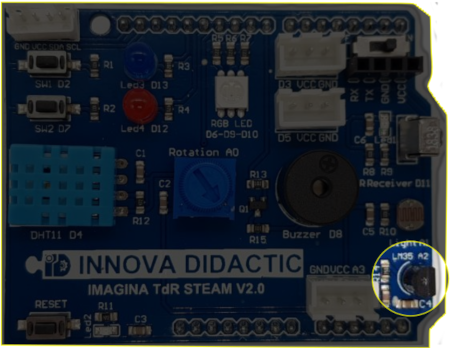
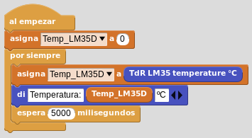

# A7- El sensor de temperatura LM35D

## **Actividad**
La placa Imagina TDR STEAM dispone de un sensor de temperatura LM35D, denominada LM35, conectada al pin A2 tal y como se indica en la serigrafía de la propia placa y que podemos ver en la imagen siguiente:

  
*El LM35 en la TdR STEAM*

El programa de la actividad va a consistir en mostrar los datos de temperatura suministrados por el LM35D. En el video siguiente vemos el funcionamiento del programa.

<iframe width="560" height="315" src="https://www.youtube.com/embed/HdJ4Hih85WE?si=0gM19LdxRK3MzvGe" title="YouTube video player" frameborder="0" allow="accelerometer; autoplay; clipboard-write; encrypted-media; gyroscope; picture-in-picture; web-share" allowfullscreen></iframe>

Podemos descargar el programa [Temperatura_LM35D.ubp](../actividades/programas/Temperatura_LM35D.ubp) o bien crearlo nosotros mismos a partir de la figura siguiente:

  
*Temperatura_LM35D.ubp*

## **Ampliación**
Se proponen, como retos de ampliación, las siguientes actividades:

**R1_A7**. Repetir el programa de la actividad mostrando los datos de forma gráfica durante unas cuantas horas o incluso un día completo. Registramos un dato cada 30 minutos. Al final del tiempo archivamos los datos en formato CSV y los analizamos de manera analítica y gráfica.

**R2_A7**. Alarma óptico/acústica por sobrepasar una temperatura de, por ejemplo, 25ºC. Utilizaremos el zumbador para emitir algún pitido y los LEDs rojo y azul encendiéndose y apagándose alternativamente para la indicación óptica.

**R3_A7**. Semáforo indicador de rangos de temperatura. Se trata de programar un semáforo con el LED RGB que se iluminará en color verde si la temperatura está por debajo de 25ºC, en rojo si está por encima de 35ºC y en amarillo si está entre ambos valores.
