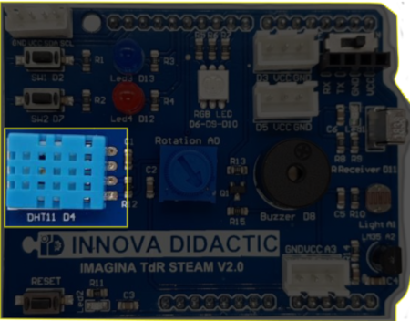

# A8- El sensor de temperatura y humedad DHT-11

## **Actividad**
La placa Imagina TDR STEAM incorpora un sensor DHT11, denominada DHT11, conectada al pin D4 tal y como se indica en la serigrafía de la propia placa y que podemos ver en la imagen siguiente:

  
*El DHT11 en la TdR STEAM*

El programa de la actividad va a consistir en mostrar los datos de temperatura y humedad suministrados por el DHT11. En el video siguiente vemos el funcionamiento del programa.

<iframe width="560" height="315" src="https://www.youtube.com/embed/Cx0hSx7sM6k?si=x9e0WDRL1WK6LSiN" title="YouTube video player" frameborder="0" allow="accelerometer; autoplay; clipboard-write; encrypted-media; gyroscope; picture-in-picture; web-share" allowfullscreen></iframe>

Podemos descargar el programa [Temp_Hum_DHT11.ubp](../actividades/programas/Temp_Hum_DHT11.ubp) o bien crearlo nosotros mismos a partir de la figura siguiente:

  
*Temp_Hum_DHT11.ubp*

## **Ampliación**
Se proponen, como retos de ampliación, las siguientes actividades:

**R1_A8**. Repetir el programa de la actividad mostrando los datos de forma gráfica durante unas cuantas horas o incluso un día completo. Registramos un dato de temperatura y humedad cada 30 minutos. Al final del tiempo archivamos los datos en formato CSV y los analizamos de manera analítica y gráfica.

**R2_A8**. Realizar un programa que nos muestre el estado de confort según las explicaciones vista en la [actividad 10 de Notas sobre ESP32 STEAMakers](https://fgcoca.github.io/ESP32-STEAMakers/A10/) y la idea de un semáforo que utilice el LED RGB para componer esos colores rojo, verde y amarillo.

Para resolver la actividad vamos a necesitar varios bloques del menú "Operadores" y especialmente combinando funciones AND y OR múltiples.
