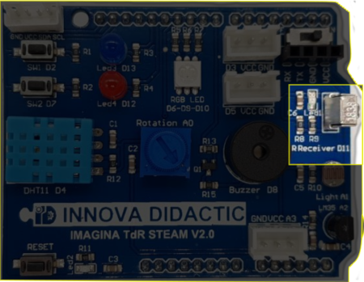
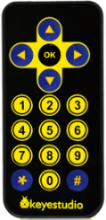
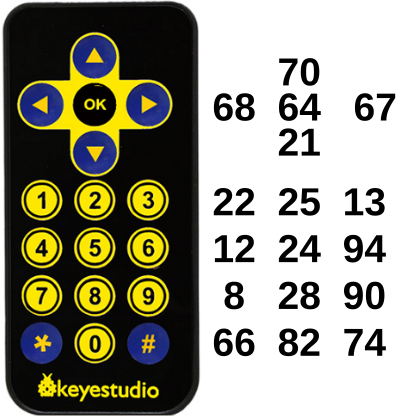
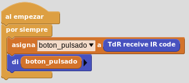

# A9- Emisor y receptor de infrarrojos

## **Actividad**
La placa Imagina TDR STEAM incorpora un diodo receptor de infrarrojos, denominada IR Receiver, conectada al pin D11 tal y como se indica en la serigrafía de la propia placa y que podemos ver en la imagen siguiente:

  
*El sensor receptor de IR en la TdR STEAM*

En nuestro caso como emisor de infrarrojos vamos a utilizar el control remoto de Keyestudio que vemos en la imagen siguiente:

  
*Control remoto de Keyestudio*

La actividad va a consistir en crear un programa que nos permita averiguar el código numérico que se recibe cuando se pulsa cada una de las teclas.

En el video siguiente vemos el funcionamiento del programa.

<iframe width="560" height="315" src="https://www.youtube.com/embed/WTzebEB6yz8?si=OlMyOadXzyFgDU-w" title="YouTube video player" frameborder="0" allow="accelerometer; autoplay; clipboard-write; encrypted-media; gyroscope; picture-in-picture; web-share" allowfullscreen></iframe>

El resultado para cada tecla lo vemos en la figura siguiente:

  
*Códigos del teclado de Keyestudio en MicroBlocks*

Podemos descargar el programa [Recep_Emisor_IR.ubp](../actividades/programas/Recep_Emisor_IR.ubp) o bien crearlo nosotros mismos a partir de la figura siguiente:

  
*Recep_Emisor_IR.ubp*

## **Ampliación**
Se proponen, como retos de ampliación, las siguientes actividades:

**R1_A9**. Reformar el programa de la actividad de manera que nos informe de la tecla pulsada pero no con el código, sino con la descripción de la tecla.

**R2_A9**. Realizar un programa en el que si pulsamos la tecla Ok del control remoto se nos encienda el diodo LED rojo y si pulsamos cualquier otra se apague.

**R3_A9**. Realizar un programa que encienda el LED RGB en los colores establecidos a continuación y según la tecla flecha pulsada.

* Flecha arriba = Rojo
* Flecha izquierda = Verde
* Flecha derecha = Amarillo
* Flecha abajo = azul
