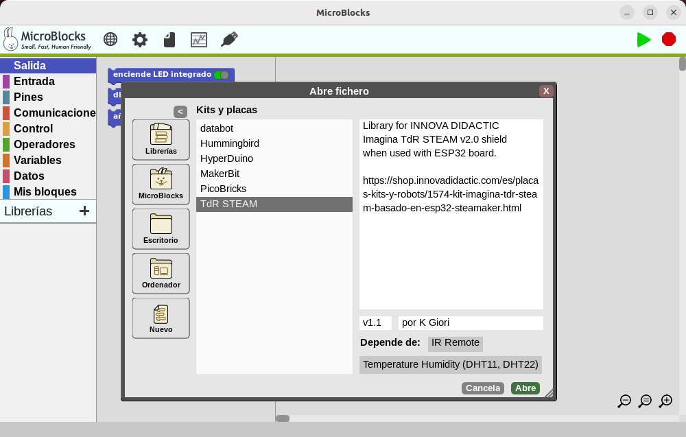

# MicroBlocks + ESP32 STEAMakers + TdRSTRAM
Guía de actividades básicas creadas a partir del trio de elementos del título:

* **MicroBlocks**. Introduciremos su uso.
* **ESP32 STEAMakers + TdRSTRAM**. Nos basaremos tanto en [Mis notas sobre ESP32 STEAMakers](https://fgcoca.github.io/ESP32-STEAMakers/) de [@fgcoca](https://x.com/fgcoca).

Nos vamos a basar en la Libreria creada por la TechWoman, [Kathy Giori](https://faberllull.cat/en/resident.cfm?id=38564&url=kathy-giori.htm) de [microbloks.fun](https://t.co/36pGfEE4qt) disponible como TdR STEAM dentro del directorio de Kits y placas.

  
*Libreria TdR STEAM en MicroBlocks*

Se desarrollarán activades para todos los elementos que componen la TdR STEAM, enlazando todas al fichero con el proyecto resuelto. También se propondrán actividades que en la mayor parte de los casos no van a estar resueltas, sino propuestas.