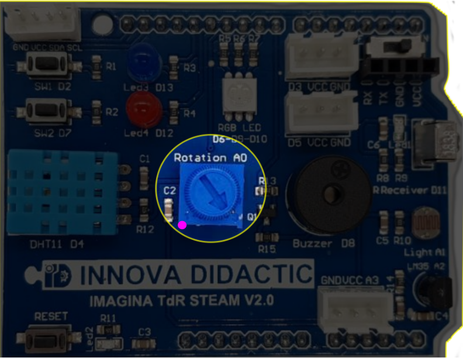

# Importante
Para que MicroBlocks reconozca y se conecte con la placa, es muy importante que el potenciómetro esté totalmente girado a la izquierda como está marcado en la imagen siguiente con el punto de color. Es decir la flecha del potenciómetro debe estar orientada a la posición del punto de color y no en la que está en la imágen.

  
*La posición del potenciómetro de la TdR STEAM*

El motivo es que el potenciómetro comparte la conexión A0 (GPIO02) con el sistema de grabación del programa y si el mismo no está en su posición de cero resistencia se producirá un error en el envío del programa a la placa porque se entenderá que los pines de transmisión están ocupados con otra tarea.

Una vez que tenemos el firmware de la placa actualizado esto ya no va a tener importancia, debido a que MicroBlocks trabaja en vivo (en tiempo real) actualizando el firmaware de la placa y mostrańdo los resultados de manera inmediata.

